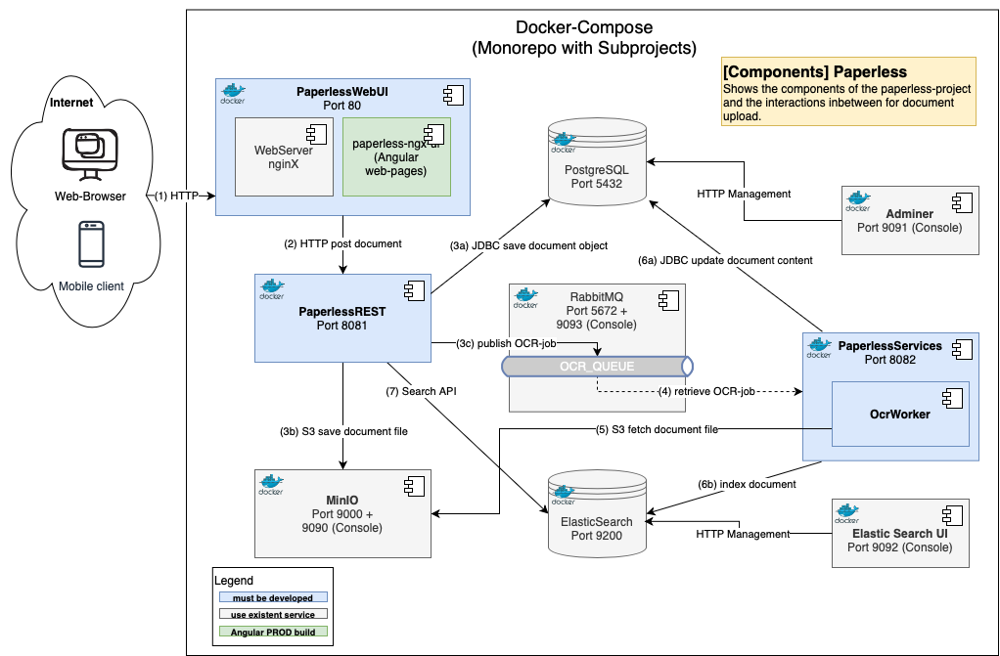

# Paperless

The semester project for the BIF-5/SWKOM course, named "Paperless," is a document management system designed for archiving documents in a FileStore. It features automatic OCR (queue for OCR recognition) and full-text search capabilities using ElasticSearch.

Link to Git: https://github.com/LukasLedermueller/Paperless

## Documentation

Paperless-ngx is a community-supported open-source document management system that transforms your physical documents into a searchable online archive so you can keep, well, less paper.

## Architecture

## Use cases
* Upload and manage documents
* Search and filter function using  ElasticSearch
* Manage Documents
